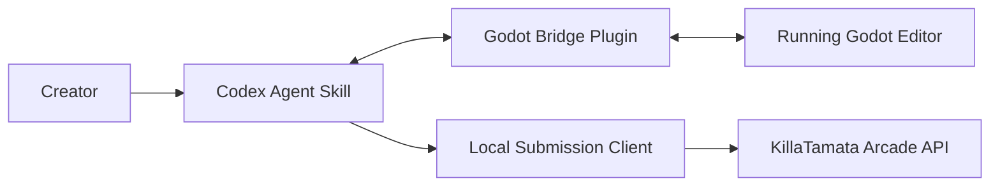

# KillaTamata Arcade Agent + Godot Plugin Specification

## Purpose

Define a focused replacement for the old GoTamata asset-pipeline bridge so a local AI agent can help a creator:

1. prepare a Godot project for KillaTamata Arcade submission,
2. validate that the project meets arcade requirements,
3. export a compliant Godot Web build,
4. package the build into the required submission artifact,
5. submit the artifact to KillaTamata.

This spec intentionally removes the old asset/resource workflow concerns. The new system is only about arcade publishing.

## Historical Reference

Use the old implementation in `gotamata` commit `5628e70` as reference for bridge shape and editor integration, but not for product scope.

Reference files from that commit:

- `agent-skill/godot-editor-agent-bridge/SKILL.md`
- `agent-skill/godot-editor-agent-bridge/references/protocol.md`
- `godot-plugin/addons/gotamata_agent_bridge/README.md`
- `godot-plugin/addons/gotamata_agent_bridge/plugin.gd`
- `godot-plugin/addons/gotamata_agent_bridge/agent_command_server.gd`
- `godot-plugin/addons/gotamata_agent_bridge/bridge_contract.json`

Keep:

- localhost-only bridge
- newline-delimited JSON command protocol
- optional shared-secret token
- explicit command contract with generated protocol docs
- small Godot editor plugin surface

Remove:

- workflow templates
- workflow runs
- artifact registry
- import recipes
- publish revision manifests
- asset-pipeline main screen
- provider job tracking for image/model generation

## Product Context

The KillaTamata Arcade pipeline already expects creators to submit a prebuilt Godot Web export bundle, not source projects.

Current server-side expectations from `media-api-server`:

- submission artifact is a ZIP of the exported web build folder
- ZIP must contain:
  - `index.html`
  - Godot-generated `.js`
  - Godot-generated `.wasm`
  - `.pck`
  - `arcade.release.json`
- `arcade.release.json` inside the ZIP is the release metadata source of truth
- manifest `entryPath` must point to an HTML file present in the ZIP
- manifest `coverImage` must resolve to a file in the ZIP unless a separate cover image is uploaded to replace it at upload time
- ZIP size limit: 64 MB
- cover image limit: 8 MB
- maximum extracted file count: 256
- Godot 4 C# web exports are not supported
- threaded web exports are rejected in V1

Current manifest schema:

- `gameSlug`
- `title`
- `version`
- `engineVersion`
- `entryPath`
- `shortDescription`
- `description`
- `display`
  - `width`
  - `height`
  - `mode` = `contain | cover | stretch`
  - `backgroundColor`
- `controls`
  - `primaryAction`
  - `secondaryAction`
  - `keyboard[]`
  - `gamepad`
  - `touch`
- `tags[]`
- `coverImage`
- `launchPriceUsdMicros`
- `supportsThreads`

Current arcade creator/public HTTP routes in `media-api-server`:

- `POST /api/v1/arcade/games`
- `GET /api/v1/arcade/games/mine`
- `GET /api/v1/arcade/games/detail`
- `GET /api/v1/arcade/catalog`
- `POST /api/v1/arcade/releases/upload`
- `PATCH /api/v1/arcade/releases/submit`
- `GET /api/v1/arcade/review/queue`
- `PATCH /api/v1/arcade/review/release`
- `POST /api/v1/arcade/launch-sessions`
- `PATCH /api/v1/arcade/launch-sessions`

Creator submission currently ends at upload/submit-for-review. Review, approval, and publish remain separate server-side responsibilities.

## Goals

### Primary Goals

- Let a local agent understand the arcade submission requirements without re-deriving them from scratch.
- Let the agent inspect a Godot project and determine what is missing for submission readiness.
- Let the agent ask the creator only the minimum necessary questions.
- Let the agent configure project metadata and export settings safely.
- Let the agent export, validate, and package the web build.
- Let the agent submit the build to KillaTamata through a stable submission client.

### Secondary Goals

- Provide a minimal in-editor UX for status, configuration, validation, and bridge control.
- Keep the bridge explicit, auditable, and safe.
- Make the system extensible for later features such as:
  - review status polling
  - update submissions for existing games
  - creator auth improvements
  - publish analytics

## Non-Goals

- No asset-generation workflows.
- No media job orchestration.
- No generic resource management.
- No remote-control surface beyond the explicit bridge contract.
- No attempt to replace KillaTamata review/publish workflows with local tooling.
- No support for threaded or C# Godot web builds in V1.

## High-Level Architecture



### Responsibility Split

- Agent skill:
  - conversation
  - project analysis
  - deciding which questions to ask
  - invoking bridge commands
  - orchestrating build/package
  - invoking submission HTTP client
  - reporting progress/failures to user

- Godot plugin:
  - Godot editor access
  - project inspection
  - export preset management
  - manifest/config read/write helpers
  - Godot export execution
  - local validation of Godot-specific constraints
  - no direct responsibility for remote submission

- Submission client:
  - HTTP interaction with KillaTamata
  - auth/session handling
  - multipart upload
  - idempotent reporting

This split is intentional. The plugin should not be turned into a network-heavy KillaTamata client if the agent can already handle HTTP.

## Deliverables

Implement both of the following in `gotamata`:

1. a Codex skill for arcade publishing
2. a Godot plugin that exposes editor/project/build capabilities over a local bridge

Recommended repo layout:

- `agent-skill/killatamata-arcade-publisher/SKILL.md`
- `agent-skill/killatamata-arcade-publisher/references/arcade_submission.md`
- `agent-skill/killatamata-arcade-publisher/references/bridge_protocol.md`
- `agent-skill/killatamata-arcade-publisher/scripts/*.py`
- `godot-plugin/addons/killatamata_arcade_bridge/plugin.cfg`
- `godot-plugin/addons/killatamata_arcade_bridge/plugin.gd`
- `godot-plugin/addons/killatamata_arcade_bridge/agent_command_server.gd`
- `godot-plugin/addons/killatamata_arcade_bridge/bridge_contract.json`
- `godot-plugin/addons/killatamata_arcade_bridge/arcade_project_config.gd`
- `godot-plugin/addons/killatamata_arcade_bridge/arcade_export_service.gd`
- `godot-plugin/addons/killatamata_arcade_bridge/arcade_validation_service.gd`
- `godot-plugin/addons/killatamata_arcade_bridge/arcade_bridge_dock.gd`

## Agent Skill Specification

### Skill Name

`killatamata-arcade-publisher`

### Skill Mission

Help a creator get a Godot project from arbitrary local state to a valid KillaTamata Arcade submission artifact and submit it.

### Agent Capabilities

The skill must support these user intents:

- "Set this Godot project up for KillaTamata Arcade."
- "Check whether this game is ready for submission."
- "Generate the arcade metadata/manifest."
- "Export the game for web."
- "Package the submission ZIP."
- "Submit this game/update to KillaTamata."
- "Show me what still needs fixing before submission."

### Required Agent Knowledge

The skill must embed or reference:

- current KillaTamata arcade manifest requirements
- current file and size limits
- unsupported export modes in V1
- creator submission route sequence
- difference between project config and generated release manifest
- safe defaults for Godot Web export

### Agent Workflow Modes

#### Mode 1: Configure

Goal: create or update project-local arcade config and export preset settings.

The agent should:

1. inspect current project state via bridge
2. detect missing config/preset values
3. ask only for unknown creator-facing metadata
4. write/update project config
5. ensure a valid Web export preset exists

#### Mode 2: Validate

Goal: produce a clear readiness report without mutating the project unless asked.

The report should include:

- blocking issues
- warnings
- inferred values
- recommended fixes
- whether the project is ready to export

#### Mode 3: Build

Goal: export a compliant web build and produce a ZIP.

The agent should:

1. validate first
2. generate `arcade.release.json`
3. export web build to staging directory
4. stage the configured cover image into the exported bundle at the manifest `coverImage` path
5. verify exported files
6. zip the export folder
7. report output paths and bundle metadata

#### Mode 4: Submit

Goal: submit a built ZIP to KillaTamata.

The agent should:

1. identify whether this is a new game or a new release of an existing game
2. ensure auth is available
3. create or reuse the arcade game record
4. read release metadata from `arcade.release.json` inside the ZIP
5. if an explicit manifest file is provided, verify that it exactly matches the embedded manifest
6. upload ZIP and optional replacement cover image
7. finalize/submit the release
8. report resulting game/release IDs and review state

#### Mode 5: Full Publish Prep

Goal: run Configure + Validate + Build + Submit as one guided flow.

### Questions The Agent May Ask

Ask only when the information cannot be inferred or safely defaulted.

Expected creator questions:

- game title
- short description
- full description
- desired game slug
- tags
- cover image path if not already configured
- control labels
- whether gamepad/touch are supported
- display width/height/mode if non-default
- launch price in USD micros or a human-friendly equivalent
- whether this should create a new arcade game or update an existing one
- auth credentials for submission if not already configured

The agent should not ask questions for:

- engine version
- entry path
- whether to use web export
- whether `index.html` should be the entry file
- whether threads should be enabled in V1

Those should be treated as system constraints and defaults.

### Agent Decision Rules

- Prefer non-destructive inspection first.
- If a required field is inferable from project metadata or existing config, do not ask.
- If a preset exists but violates arcade rules, explain the difference and offer to fix it.
- If the project appears to be C#, stop and explain that current KillaTamata arcade V1 does not support Godot 4 C# web export.
- If the export uses threads or asks for thread support, stop with a clear V1 incompatibility message.
- If a cover image is missing or unreadable, treat that as a build blocker because the plugin is expected to stage the manifest cover asset into the bundle.
- Never submit automatically after mutating configuration unless the user explicitly asked to submit or asked for the full flow.

### Agent Output Requirements

For any task, the skill should return:

- current phase
- actions taken
- remaining blockers
- artifact paths if generated
- next action

For submission tasks, also return:

- created or resolved game slug
- game ID
- release ID
- whether submission reached `uploaded` or `in_review`

### Agent Safety Rules

- Do not edit arbitrary project files when a bridge command exists for the same purpose.
- Do not guess on creator-facing descriptions or pricing unless the user asked for drafting help.
- Do not submit builds that fail validation.
- Do not delete previous staged exports unless the user asked for cleanup.
- Do not assume review or publish rights.

## Godot Plugin Specification

### Plugin Name

`KillaTamata Arcade Bridge`

### Supported Editor Version

- Godot `4.6` target

### Plugin Mission

Expose a narrow set of Godot editor and arcade-build operations over a localhost bridge so the agent can configure and build arcade-ready releases safely.

### UI Surface

Implement a lightweight dock, not a full workflow main screen.

Recommended dock sections:

- bridge status
  - host
  - port
  - token enabled/disabled
  - last connection time
- project summary
  - project name
  - configured arcade slug/title/version
  - export preset status
  - validation status
- actions
  - validate project
  - ensure web export preset
  - generate manifest preview
  - export release
  - reveal export folder
- logs
  - recent bridge requests
  - recent validation/build events

### Plugin Storage Model

Use two distinct local artifacts:

1. committed project config
2. generated build outputs

Recommended paths:

- project config: `res://killatamata.arcade.json`
- staged outputs: `res://.gotamata/arcade_builds/<slug>/<version>/`
- optional export ZIP: `res://.gotamata/arcade_builds/<slug>/<version>/<slug>-<version>.zip`

The generated `arcade.release.json` belongs inside the exported build folder and ZIP, not as the canonical source-of-truth config file.
For submission, that embedded manifest is authoritative over any separate local JSON file.

### Project Config Schema

Define a Godot-side project config document that the plugin owns and the agent can read/write via bridge commands.

Suggested schema:

```json
{
  "schemaVersion": 1,
  "gameSlug": "neon-reef-runner",
  "title": "Neon Reef Runner",
  "shortDescription": "Arcade dodger through bioluminescent ruins.",
  "description": "Longer creator-facing description.",
  "version": "0.1.0",
  "coverImageSource": "res://art/cover.png",
  "tags": ["arcade", "action"],
  "display": {
    "width": 1280,
    "height": 720,
    "mode": "contain",
    "backgroundColor": "#000000"
  },
  "controls": {
    "primaryAction": "Dash",
    "secondaryAction": "Fire",
    "keyboard": ["Arrow Keys", "Space", "X"],
    "gamepad": true,
    "touch": false
  },
  "launchPriceUsdMicros": 0,
  "supportsThreads": false,
  "entryPath": "index.html",
  "exportPresetName": "KillaTamata Arcade Web",
  "stagingBaseDir": "res://.gotamata/arcade_builds"
}
```

Notes:

- `engineVersion` should be derived from the running editor and injected into the generated release manifest.
- `entryPath` should default to `index.html`.
- `supportsThreads` must default to `false`.

### Bridge Transport

Reuse the old bridge transport shape:

- host: `127.0.0.1`
- port: default `47891`
- framing: newline-delimited JSON
- request:

```json
{
  "id": "req-123",
  "token": "optional-shared-secret",
  "command": "project_state",
  "args": {}
}
```

- response success:

```json
{
  "ok": true,
  "id": "req-123",
  "command": "project_state",
  "result": {}
}
```

- response error:

```json
{
  "ok": false,
  "id": "req-123",
  "command": "project_state",
  "error": {
    "code": "validation_failed",
    "message": "Human-readable message",
    "details": {}
  }
}
```

### Required Commands

Keep the command set small and explicit.

#### Core

- `ping`
  - returns plugin identity, version, project path, server status

- `list_commands`
  - returns the supported contract

#### Editor/Project Inspection

- `editor_state`
  - returns current edited scene path, root node name, play state

- `project_state`
  - returns project path, Godot version, whether C# is detected, current config file path, export preset summary, and validation summary

- `open_scene`
  - optional convenience command retained from the old bridge

- `save_scene`
  - optional convenience command retained from the old bridge

#### Arcade Config

- `get_arcade_project_config`
  - returns parsed config or null if missing

- `upsert_arcade_project_config`
  - writes normalized config
  - should support partial updates merged into existing config

- `generate_arcade_manifest_preview`
  - resolves the exact manifest JSON that would be written into the exported bundle

#### Export Preset Management

- `list_export_presets`
  - returns preset summaries

- `ensure_arcade_web_export_preset`
  - creates or updates a preset that satisfies KillaTamata arcade requirements
  - should not mutate unrelated presets

- `validate_arcade_web_export_preset`
  - returns blocking issues and warnings for the active arcade preset

The preset validator should enforce at minimum:

- Web export preset exists
- output file is `index.html`
- threads disabled
- export path is valid
- preset is enabled

#### Validation

- `validate_arcade_project`
  - returns structured validation result:
    - `ok`
    - `blockingIssues[]`
    - `warnings[]`
    - `inferredValues`
    - `manifestPreview`
    - `exportPresetSummary`

Validation should cover:

- config file completeness
- slug normalization
- required descriptions
- cover image existence
- unsupported C# project detection
- unsupported threaded export detection
- export preset readiness

#### Build

- `build_arcade_release`
  - performs:
    - validation
    - manifest generation
    - export to staging directory
    - post-export file verification
    - ZIP creation
  - returns:
    - staging directory
    - ZIP path
    - manifest
    - exported file inventory
    - cover image path if resolved

- `reveal_arcade_build`
  - optional convenience command for local UX

### Bridge Command Non-Goals

Do not add commands for:

- arbitrary filesystem traversal
- generic property editing
- asset-library browsing
- workflow templates
- job status tracking
- artifact publishing
- remote HTTP submission

If a helper command is needed, add the narrowest possible arcade-specific command instead of a broad generic one.

### Plugin Validation Semantics

Use two levels:

- blocking issue: cannot produce a valid KillaTamata submission
- warning: submission may technically work but should be reviewed

Examples of blocking issues:

- missing title
- missing descriptions
- missing web export preset
- preset output not `index.html`
- C# project detected
- threads enabled
- export failed
- required Godot web output files missing

Examples of warnings:

- no cover image configured
- launch price is zero
- touch/gamepad support omitted
- display size not set

### Logging

The plugin should keep lightweight local logs for:

- bridge command received
- validation run
- export run
- ZIP creation
- last error

Expose recent log lines in the dock and through an optional `get_recent_logs` command if useful.

### Security

- bridge must listen on localhost only
- auth token should be optional but supported
- no command execution shell escape
- no arbitrary method-call surface like the old generic `call`
- avoid commands that permit unexpected mutation outside the project/build workflow

## Submission Client Specification

The agent needs a small submission client library or helper scripts to talk to KillaTamata after the plugin has produced a ZIP.

### Responsibilities

- resolve auth
- create a new arcade game when needed
- list existing creator games
- upload release bundle and optional cover
- finalize submission

### Suggested Local Layout

- `agent-skill/killatamata-arcade-publisher/scripts/submission_client.py`
- `agent-skill/killatamata-arcade-publisher/scripts/send_bridge_command.py`

### Expected API Sequence

#### New Game + New Release

1. `POST /api/v1/arcade/games`
   - body:
     - `slug`
     - `title`
     - `shortDescription`
     - `description`
     - `tags`

2. `POST /api/v1/arcade/releases/upload`
   - multipart fields:
     - `gameId`
     - `manifestJson` matching `arcade.release.json` inside the ZIP
     - `bundle`
     - `coverImage` optional replacement

3. `PATCH /api/v1/arcade/releases/submit`
   - body:
     - `releaseId`

#### Existing Game + New Release

1. `GET /api/v1/arcade/games/mine`
2. resolve desired `gameId`
3. `POST /api/v1/arcade/releases/upload`
4. `PATCH /api/v1/arcade/releases/submit`

### Auth Requirement

This is the main external dependency for the implementation.

The submission client must be written behind an auth abstraction because creator submission auth may evolve.

Implement this interface:

- `ensure_authenticated()`
- `authenticated_request(...)`
- `describe_auth_state()`

Preferred auth order:

1. dedicated creator API token if KillaTamata exposes one
2. local browser-session backed auth flow if that is how creator submission currently works
3. explicit user-provided temporary token/cookie header as fallback for development

Do not bake a single auth mechanism deep into the agent workflow. Submission must be behind a replaceable adapter.

## Agent-to-Plugin Workflow Contract

### Happy Path

1. `ping`
2. `project_state`
3. `get_arcade_project_config`
4. if needed, ask user for missing metadata
5. `upsert_arcade_project_config`
6. `ensure_arcade_web_export_preset`
7. `validate_arcade_project`
8. `build_arcade_release`
9. submission client:
   - create or resolve game
   - read manifest from ZIP
   - upload ZIP
   - submit release
10. return submission summary to user

### Failure Path

If validation fails:

- do not export
- present blocking issues
- propose exact fixes

If export fails:

- preserve logs and staging info
- return failed step, error payload, and any partial outputs

If upload fails:

- preserve ZIP path
- preserve resolved game info
- report the API error and whether retry is safe

## Suggested Prompting Rules For The Skill

The skill should instruct the implementation agent to:

- start with inspection, not assumptions
- ask only for missing creator-authored metadata
- present choices clearly when a project could be treated as a new game or an update
- prefer fixing export settings through narrow bridge commands rather than direct raw file edits
- show the creator the exact output paths of built artifacts
- stop before submission if the user only asked for configuration/build
- preserve idempotency when retrying submissions

## Suggested Protocol Documentation Generation

Reuse the old pattern of keeping a machine-readable bridge contract in the plugin and generating human docs for the skill.

Recommended source of truth:

- `godot-plugin/addons/killatamata_arcade_bridge/bridge_contract.json`

Generated docs:

- `agent-skill/killatamata-arcade-publisher/references/bridge_protocol.md`

Optional helper:

- `tools/sync_bridge_contract.py`

## Implementation Phases

### Phase 1: Minimal Bridge

Deliver:

- plugin skeleton
- localhost server
- token support
- `ping`
- `list_commands`
- `project_state`
- `get_arcade_project_config`
- `upsert_arcade_project_config`
- `list_export_presets`
- `ensure_arcade_web_export_preset`
- `validate_arcade_web_export_preset`
- `validate_arcade_project`

Acceptance:

- agent can inspect a project and make it submission-ready

### Phase 2: Build Artifact Generation

Deliver:

- `generate_arcade_manifest_preview`
- `build_arcade_release`
- staging directory management
- ZIP creation
- post-export verification

Acceptance:

- agent can produce a valid ZIP and manifest from a Godot project without manual editor interaction

### Phase 3: Submission Skill

Deliver:

- new skill docs
- bridge helper script
- submission client
- auth abstraction
- new game + new release flow
- existing game + new release flow

Acceptance:

- agent can submit a built release into KillaTamata and report release state

### Phase 4: UX Polish

Deliver:

- dock polish
- build history summary
- friendlier validation messaging
- retry-safe submission UX

Acceptance:

- manual creators can understand state in-editor even without using the bridge directly

## Acceptance Criteria

The implementation is complete when all of the following are true:

- a Codex agent in `gotamata` can detect and explain submission readiness for a Godot project
- the agent can create or update `killatamata.arcade.json`
- the plugin can ensure a compliant Godot Web export preset
- the plugin can reject C# and threaded exports in V1
- the plugin can export a real project to a staging folder
- the plugin can produce a ZIP containing a valid `arcade.release.json`
- the agent can submit that ZIP to KillaTamata through the submission client
- the implementation does not revive the old asset/resource workflow surface
- the bridge contract is documented and testable

## Test Plan

### Unit-Level

- config normalization
- slug normalization
- manifest generation
- export preset validation
- C# detection
- thread-support rejection
- ZIP file inventory verification

### Plugin Integration

- command server accepts valid JSON lines
- invalid token is rejected
- each command returns structured success/error payloads
- `build_arcade_release` produces expected files for a sample Godot project

### End-to-End

Using a lightweight sample game:

1. configure project through the agent
2. generate config
3. validate successfully
4. export to web
5. produce ZIP
6. submit to KillaTamata
7. verify release enters creator submission flow

### Regression Checks

- no workflow-template UI or files reintroduced
- no generic remote-call command exposed
- no remote submission logic embedded inside the plugin

## Explicit Anti-Patterns

Do not:

- recreate the old asset pipeline as a special case of arcade publishing
- add a generic `call` escape hatch
- push HTTP submission into Godot unless there is a clear reason the agent cannot own it
- make the bridge depend on a running website
- require the creator to hand-edit `arcade.release.json`

## Implementation Notes For The Agent Working In `gotamata`

- Start by recovering the old bridge architecture from commit `5628e70`.
- Reuse transport/server patterns where they are clean.
- Delete pipeline-specific concepts aggressively rather than trying to repurpose them.
- Build the new bridge contract from scratch around arcade publishing.
- Keep the public surface narrow and documented.
- Prefer a small, reliable tool over a broad magical one.
